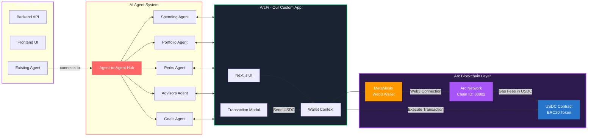

<div align='center'>
    <a href='https://agent-arc.netlify.app/'>

    </a>
</div>


<h2 align='center'>ArcFi — AI Agents on Arc with USDC</h2>

This project was built for the **AI Agents on Arc with USDC Hackathon**, reimagining retail banking through intelligent multi-agent systems powered by **Google’s Agent Development Kit (ADK)**, the **Agent-to-Agent (A2A) Protocol**, the **Gemini API**, and the **Arc blockchain** — a **USDC-native Layer-1** designed for stable, secure financial automation.

## What This Project Does

ArcFi transforms traditional banking into **autonomous finance** by combining **AI-driven intelligence** with **on-chain execution**. Instead of relying on a single chatbot or static dashboard, users engage with a network of specialized AI agents operating on the Arc blockchain, executing secure USDC transactions while delivering real-time financial insights.

### The Agents

The system consists of six specialized agents working together as one coordinated financial ecosystem:

- **Chat Orchestrator** – Routes user queries to the relevant specialist agent and unifies responses  
- **Spending Agent** – Tracks transactions, spending patterns, and budgets  
- **Perks Agent** – Optimizes rewards, cashback programs, and loyalty points  
- **Portfolio Agent** – Analyzes investments, portfolio allocations, and market data  
- **Goals Agent** – Sets and tracks financial goals, savings, and progress  
- **Advisors Agent** – Connects users with professional financial advisors for personalized guidance  

Each agent connects through the **A2A Protocol**, sharing context securely while leveraging **Arc blockchain’s smart contracts** and **USDC-based transactions** to provide trustless, transparent, and auditable operations.

## Architecture

### Frontend
- **Framework**: Next.js 15.4.6 with React 19  
- **Language**: TypeScript  
- **Styling**: Tailwind CSS with shadcn/ui components  
- **Port**: 3000 (default)  
- **On-chain Integration**: USDC payment interface using Arc’s wallet SDK  

### Backend
- **Framework**: Google Agent Development Kit (ADK)  
- **Protocol**: Agent-to-Agent (A2A) for inter-agent collaboration  
- **Language**: Python (3.10+)  
- **AI Model**: Gemini 2.5 Flash  
- **Blockchain Layer**: Arc (EVM-compatible) with USDC for gas fees and transactions  

### Agent Ports
- Chat Orchestrator: `8090`  
- Spending Agent: `8081`  
- Perks Agent: `8082`  
- Portfolio Agent: `8083`  
- Goals Agent: `8084`  
- Advisors Agent: `8085`

### Workflow


## Getting Started

### Prerequisites

You’ll need the following installed:

- **Node.js** (v20+)  
- **Python** (3.10–3.12)  
- **uv** (Python package manager) – [Install here](https://github.com/astral-sh/uv)  
- **Google API Key** (for Gemini API access)  
- **Arc Testnet Wallet** with **Testnet USDC Faucet** access  

### Setup Instructions

#### 1. Configure Environment Variables

Add your `GOOGLE_API_KEY` to the `.env` file in each agent directory:

```bash
GOOGLE_API_KEY=your_api_key_here
````

#### 2. Start the Agents

In the agents directory, run:

```bash
cd agents
make agents
```

This will launch all agents on their respective ports.

#### 3. Start the Frontend

In a new terminal:

```bash
cd frontend
npm install   # Run once
npm run dev
```

The app will be live at `http://localhost:3000`

## How It Works

1. **User Interaction** – The user interacts through a chat-based dashboard built with Next.js.
2. **Query Routing** – The Chat Orchestrator analyzes intent and delegates the task to the right AI agent.
3. **Agent Collaboration** – Agents process data via A2A Protocol and retrieve contextual data (spending, goals, investments).
4. **On-chain Execution** – When needed, agents execute secure **USDC transactions** on the **Arc blockchain** via smart contracts.
5. **Learning Feedback Loop** – Transaction data is fed back into AI context for improved recommendations.
6. **Response Delivery** – The orchestrator compiles insights and returns a personalized, real-time response to the user.

## Technologies Used

* **[Arc Blockchain](https://www.arc.network/)** – EVM-compatible, USDC-native Layer-1 for stablecoin-based finance
* **USDC** – Stable digital dollar used for all transactions and gas fees
* **[Google ADK](https://google.github.io/adk-docs/)** – Multi-agent system development framework
* **[A2A Protocol](https://developers.googleblog.com/en/a2a-a-new-era-of-agent-interoperability/)** – Agent communication standard
* **[Gemini API](https://ai.google.dev/)** – Natural language AI for contextual financial reasoning
* **Next.js** – React-based framework for the frontend interface
* **TypeScript** – Type-safe client-side code
* **Python** – Backend implementation for AI agents

## Project Structure

<details>
  <summary><b>📂 Click to view full repository structure</b></summary>

```bash
temp-repo/
├── .git/                                    # Git repository
├── .gitignore                               # Git ignore rules
├── README.md                                # Project documentation
├── DEPLOYMENT.md                            # Deployment instructions
├── netlify.toml                             # Netlify deployment config
│
├── agents/                                  # 🤖 Multi-agent backend (Python)
│   ├── .venv/                               # Python virtual environment
│   ├── Makefile                             # Agent startup commands
│   ├── pyproject.toml                       # Python dependencies
│   ├── uv.lock                              # Dependency lock file
│   ├── chat/                                # Chat orchestrator agent
│   │   └── chat/
│   │       ├── __init__.py
│   │       ├── agent.py
│   │       └── cymbal_agent_wrapper.py
│   ├── spending_snapshot_agent/             # Spending analysis agent
│   │   ├── pyproject.toml
│   │   └── spending_snapshot_agent/
│   │       ├── __init__.py
│   │       ├── agent.py
│   │       └── cymbal_agent_wrapper.py
│   ├── portfolio_snapshot_agent/            # Portfolio analysis agent
│   │   ├── pyproject.toml
│   │   └── portfolio_snapshot_agent/
│   │       ├── __init__.py
│   │       ├── agent.py
│   │       └── cymbal_agent_wrapper.py
│   ├── perks_snapshot_agent/                # Perks management agent
│   │   ├── pyproject.toml
│   │   └── perks_snapshot_agent/
│   │       ├── __init__.py
│   │       ├── agent.py
│   │       └── cymbal_agent_wrapper.py
│   ├── advisors_snapshot_agent/             # Advisory services agent
│   │   ├── pyproject.toml
│   │   └── advisors_snapshot_agent/
│   │       ├── __init__.py
│   │       ├── agent.py
│   │       └── cymbal_agent_wrapper.py
│   └── goals_snapshot_agent/                # Goals tracking agent
│       ├── pyproject.toml
│       └── goals_snapshot_agent/
│           ├── __init__.py
│           ├── agent.py
│           └── cymbal_agent_wrapper.py
│
└── frontend/                                # 💻 Next.js frontend application
    ├── .next/                               # Next.js build output
    ├── node_modules/                        # Node dependencies
    ├── .gitignore                           # Frontend-specific ignores
    ├── package.json                         # Node dependencies (ethers.js v6)
    ├── package-lock.json                    # Dependency lock file
    ├── next.config.ts                       # Next.js configuration
    ├── tsconfig.json                        # TypeScript configuration
    ├── next-env.d.ts                        # Next.js TypeScript types
    ├── eslint.config.mjs                    # ESLint configuration
    ├── postcss.config.mjs                   # PostCSS configuration
    ├── components.json                      # Shadcn UI components config
    ├── README.md                            # Frontend documentation
    │
    ├── app/                                 # Next.js App Router
    │   ├── favicon.ico                      # Site icon
    │   ├── globals.css                      # Global styles (Arc animations)
    │   ├── layout.tsx                       # Root layout
    │   ├── page.tsx                         # Login page (Arc branding)
    │   ├── (dashboard)/                     # Dashboard routes group
    │   │   ├── layout.tsx                   # Dashboard layout (Sidebar)
    │   │   ├── spending/
    │   │   │   └── page.tsx                 # Spending agent page
    │   │   ├── portfolio/
    │   │   │   └── page.tsx                 # Portfolio agent page
    │   │   ├── perks/
    │   │   │   └── page.tsx                 # Perks agent page
    │   │   └── advisors/
    │   │       └── page.tsx                 # Advisors agent page
    │   └── api/                             # API routes
    │       └── cymbal/                      # Cymbal agent endpoints
    │           ├── chat/
    │           ├── spending-snapshot/
    │           ├── portfolio-snapshot/
    │           ├── perks-snapshot/
    │           └── advisors-snapshot/
    │
    ├── components/                          # React components
    │   ├── auth/                            # Authentication components
    │   │   ├── AuthContext.tsx              # Auth provider
    │   │   └── LoginForm.tsx                # Login form
    │   ├── layout/                          # Layout components
    │   │   ├── Sidebar.tsx                  # Sidebar (Arc wallet button)
    │   │   └── SplitView.tsx                # Split view layout
    │   ├── transaction/                     # Transaction components
    │   │   └── TransactionModal.tsx         # USDC transaction modal (Arc)
    │   ├── spending/                        # Spending-specific components
    │   │   ├── SpendingSnapshot.tsx
    │   │   ├── SpendingChat.tsx
    │   │   ├── SpendingCard.tsx
    │   │   ├── InsightsCard.tsx
    │   │   ├── ActivitiesList.tsx
    │   │   ├── AgentMessage.tsx
    │   │   ├── UserMessage.tsx
    │   │   └── ChatInput.tsx
    │   ├── portfolio/                       # Portfolio-specific components
    │   │   ├── PortfolioSnapshot.tsx
    │   │   ├── PortfolioChat.tsx
    │   │   └── PortfolioCard.tsx
    │   ├── perks/                           # Perks-specific components
    │   │   ├── PerksSnapshot.tsx
    │   │   ├── PerksChat.tsx
    │   │   └── PerksCard.tsx
    │   ├── advisors/                        # Advisors-specific components
    │   │   ├── AdvisorsSnapshot.tsx
    │   │   ├── AdvisorsChat.tsx
    │   │   └── AdvisorsCard.tsx
    │   └── ui/                              # Reusable UI components (Shadcn)
    │       ├── button.tsx
    │       ├── card.tsx
    │       ├── input.tsx
    │       ├── badge.tsx
    │       └── alert.tsx
    │
    ├── lib/                                 # Utilities and types
    │   ├── utils.ts                         # Utility functions
    │   ├── mockData.ts                      # Mock data for demo mode
    │   ├── arc/                             # 🔗 Arc blockchain integration
    │   │   ├── config.ts                    # Arc network & USDC config
    │   │   └── WalletContext.tsx            # Web3 wallet provider (ethers.js)
    │   └── types/                           # TypeScript type definitions
    │       ├── spending.ts
    │       ├── portfolio.ts
    │       ├── perks.ts
    │       ├── advisors.ts
    │       └── chat.ts
    │
    └── public/                              # Static assets
        └── (images, fonts, etc.)
```
</details>


## Notes

* All agents must be active before starting the frontend.
* The **A2A Protocol** handles secure communication between agents.
* The **Arc blockchain** ensures all financial actions are verifiable and stable with **USDC-based gas fees**.
* Agents maintain autonomy but collaborate through the orchestrator for seamless user experiences.

## Troubleshooting

### Agents Won’t Start

* Ensure your `GOOGLE_API_KEY` is in all `.env` files
* Confirm ports 8081–8085 and 8090 are free
* Run `python --version` to confirm you’re using Python 3.10+

### Frontend Can’t Connect

* Check if all agents are running
* Review browser console for connection or CORS issues
* Ensure Arc Testnet RPC is correctly configured

### Missing Modules

* Run `uv sync` in the agents directory
* Run `npm install` in the frontend directory

<div align="center">

  <h1><u>Our Team</u></h1>

  <table>
    <tr>
      <td>
        <a href="https://github.com/SaifRasool92">
          <br>
          <sub><b>Saif Ur Rasool</b></sub>
        </a>
      </td>
      <td>
        <a href="https://github.com/Meharzain2010">
          <br>
          <sub><b>Zia Ur Rehman</b></sub>
        </a>
      </td>
      <td>
        <a href="https://github.com/">
          <br>
          <sub><b>Hilda Posada</b></sub>
        </a>
      </td>
      <td>
        <a href="https://github.com/merstella">
          <br>
          <sub><b>Phuc Hoang</b></sub>
        </a>
      </td>
      <td>
        <a href="https://github.com/MariamTahir-07">
          <br>
          <sub><b>Mariam Tahir</b></sub>
        </a>
      </td>
    </tr>
  </table>

---

Built with ❤️ on the **Arc Blockchain** using **USDC**, **AI Agents**, and **Gemini Intelligence** —
**ArcFi: The Future of Autonomous Banking**


